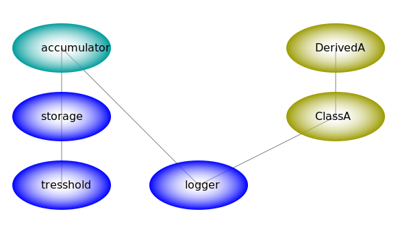

# Реализация контейнера внедрения зависимостей на JavaScript

+ Лаконичность в настройке
+ Отложенная загрузка модулей
+ Возможность отложенной загрузки зависимостей через внедрение самого контейнера
+ Возможность создавать как одиночные *singlton* службы, так и отсоединенные
+ Небольшой размер модуля контейнера (не более 80 строк кода)
+ Асинхронная реализация разрешает конкурентное создание *singlton* зависимостей



Граф зависимоcтей отражает связи между службами. Так, созданию отсоединенного экземпляра *accum* должно предшествовать создание *singlton* экземпляров *logger* и *storage*, а последнему - создание *singlton* экземпляра *tresshold*.

## Шаблон определения модулей Dependency Injection

Шаблон **Dependency Injection** основывается на предоставлении модулю всех зависимостей в качестве входных данных фабричной функции. Так ослабляются связи между модулями, позволяя настроить использование любых зависимостей, следовательно, повторно использовать код в различных контекстах.

``` js
//фабричная функция службы accumulator
module.exports = (storage, logger) => {
    //возвращаем экземпляр службы
}
module.exports.sname = "Accumulator service";
module.exports.deps = ["storage", "logger"];
```

Дополнительно, в свойствах фабричной функции указывается массив строк с именами зависимостей (если имеются), а также для отладочных целей - поле *sname*.

Согласитесь, это необременительные требования к определению модулей. Важно соблюсти порядок следования зависимостей в фабричной функции и имен зависимостей в свойстве *deps*.

## Контейнер внедрения зависимостей

Ответсвенность за создание экземпляров и дальнейший жизненный цикл, поиск и внедрение зависимостей, лежит на объекте, называемом **Dependency Injection Container** или DI-контейнер.

Экземпляры служб и весь граф зависимостей создаются в *ленивом* режиме (**Lazy loading**) без необходимости предварительной загрузки модулей.

Реализация DI-контейнера соответствует шаблону **Dependency Injection**, чтобы другие службы могли его внедрить. Такая возможность позволяет отложить загрузку отдельных зависимостей, используя внедренный контейнер в качестве локатора служб.

## Реализация синхронного DI-контейнера

``` js
module.exports = (logger) => {

    const map = new Map();

    const di = {
        get: (key, whom='di') => {
            const mod = map.get(key);
            //{ path, expo, inst })
            if (!mod) throw new Error(`Can't find ${key} entry for ${whom} !!`);
            if (mod.inst) return mod.inst;
            logger.info(`Loading factory for ${key} from path: ${mod.path}`);
            if (!mod.expo) load(mod, whom);
            //instantiate direct or with injected dependencies
            if (!mod.expo.deps) mod.inst = mod.expo();
            else mod.inst = inject(mod);
            const inst = mod.inst;
            if (mod.detach) mod.inst = null;
            return inst;
        },
        detach: (key, value) => {
            const mod = map.get(key);
            if (!mod) throw new Error(`Can't find ${key} entry for detaching !!`);
            mod.detach = value;
        },
        set: (key, mod) => {
            if (!mod.inst && !mod.expo && !mod.path)
                logger.error(`Entry for ${key} not set !!`);
            else
                map.set(key, mod);
        },
        add: (modules) => {
            //map each key to appropriate path
            for (const key in modules) 
                map.set(key, { path: modules[key] });
        },
        each: (cb) => {
            //cb(mod, key, map)
            map.forEach(cb);
        },
    }

    function inject(mod) {
        const expo = mod.expo;
        const args = expo.deps.map(dep => di.get(dep, expo.sname));
        return expo.apply(null, args);
    }

    function load(mod, whom) {
        try {
            //expose service factory
            mod.expo = require(mod.path);
            return mod.expo;
        }
        catch (err) {
            throw new Error(`Can't load module from path: ${mod.path} for ${whom}!!`);
        };
    }

    map.set('di', { inst: di });

    return di;
};

module.exports.sname = 'di container sync';
module.exports.deps = ['logger'];
```

Метод *add* DI-контейнера загружает описание служб из объекта, в свойствах которого указаны пути для загрузки модулей, а имена свойств - это имена регистрируемых служб. Такие объекты удобно хранить во внешних json-файлах, наподобие этого:

```json
{
    "config": "./config",
    "logger": "./logger",
    "storage": "./model/storage",
    "tresshold": "./model/tresshold",
    "accum": "./model/accumulator",
    "ClassA": "./model/class-a",
    "DerivedA": "./model/derived-a"
}
```

Регистрация служб носит отложенный характер, никакие модули не загружаются. Всё волшебство происходит в момент обращения за экземпляром службы с помощью метода *get*.

Если ключ <имя службы> найден, но экземпляр не создан, проверяется загружена ли фабрика, если нет, то она загружается функцией *load*.

Если у службы нет зависимостей, то для создания экземпляра вызывается фабрика без аргументов. Иначе, вызывается функция *inject*, которая заполняет массив аргументов, рекурсивно запрашивая зависимости у контейнера, затем вызывает фабрику, передавая ей этот массив.

По умолчанию, возвращается *singlton* объект - служба, указатель на которую сохраняется в контейнере и возвращается при последующих запросах.

Метод *detach* DI-контейнера помечает службу как отсоединенную *detached*. Запрос отсоединенной службы методом *get* возвращает новый экземпляр, не связанный с временем жизни контейнера.

## Пример использования синхронного DI-контейнера

``` js
const logger = { info: console.log, error: console.error }
//const logger = require('./logger')();
const di = require('./di-cont-sync')(logger);
di.add(require('./modules.json'));

try {
    //detached, not singleton
    di.detach('accum', true);
    //but depends of singleton storage
    const a1 = di.get('accum');
    a1.add(1);
    a1.add(4);
    logger.info('Amount is %d', a1.tot);
    //Amount is 5
    const a2 = di.get('accum');
    a2.add(10);
    a2.add(40);
    logger.info('Amount is %d', a2.tot);
    //Amount is 50
    const a3 = di.get('accum');
    a3.add(100);
    a3.add(400);
    logger.info('Amount is %d', a3.tot);
    //Amount is 500
    const s = di.get('storage');
    logger.info('Total amount is %d', s.tot)
    //Total amount is 555
}
catch (err) {
    logger.error(`Catch: ${err}`);
}
```

Отсоединенные экземпляры *accum* накапливают итоги в собственных регистрах, независимо друг от друга. Все они разделяют *singleton* зависимость *storage*, в которой накапливается общий итог всех аккумуляторов.

Служба *storage* имеет *singleton* зависимость *tresshold*, в которой хранится некоторое пороговое значение, превышение которого выводит в консоль *logger*.

DI-контейнер зависит от службы *logger*, чтобы отслеживать порядок загрузки, создания экземпляров или возникающие при этом ошибки.

Чтобы службы использовали тот же *logger*, что и контейнер, создайте и зарегистрируйте экземпляр:

``` js
const logger = require('./logger')();
const di = require('./di-cont-sync')(logger);
di.set('logger', { inst: logger });
```

## Реализация наследования классов

Пусть служба *ClassA* возвращает определение класса:

``` js
module.exports = () => {

    class ClassA {
        constructor(name) {
            this._name = name;
        }

        get name() {
            return this._name;
        }
    }
    return ClassA;
};

module.exports.sname = "class A";
```

Фабричная функция возвращает определение класса, давая свободу от зависимостей конструктору. В таком случае, наследуемый класс можно передать фабрике как зависимость.

``` js
module.exports = (ClassA, logger) => {

    class DerivedA extends ClassA {
        constructor(name) {
            super(name);
        }

        sum(a, b) {
            logger.info(`${this.name} calculated ${a} + ${b}`);
            return a + b;
        }
    }
    return DerivedA;
};

module.exports.sname = "derived A";
module.exports.deps = ["ClassA", "logger"];
```

## Отложенная загрузка служб в асинхронном DI-контейнере

Представим веб-сервер, у которого имеются десятки служб. Если скорость его запуска критически важна, то архитектура асинхронной отложенной загрузки служб решит две задачи.

+ Во-первых, позволит приложению запускаться быстро, с минимальным количеством служб
+ Во-вторых, загружая службу и её зависимости асинхронно, сервер останется отзывчивым

Отзывчивость сервера тоже повышает производительность. Пока идёт создание отложенных служб, можно одновременно отправлять асинхронные запросы к уже запущенным службам, например, доступа к БД. К тому времени, когда службы запустятся, ответы от БД уже придут.

Если служба имеет своё дерево отложенных зависимостей, то процесс создания экземпляра может растянутся на несколько циклов событий.

Когда происходит несколько конкурентных запросов на создание *singleton* службы, которая имеет отложенные зависимости, велика вероятность создания дубликатов, что в данном случае неприемлемо.

Решением является следующий подход. Контейнер начинает исполнение кода *get* по созданию *singleton* экземпляра с зависимостями, только для первого обратившегося, а остальным отправляет один и тот же промис, который разрешится созданным экземпляром.

## Реализация асинхронного DI-контейнера

``` js
module.exports = (logger) => {

    const map = new Map();

    const di = {
        get: async (key, whom='di') => {
            const mod = map.get(key);
            //{ path, expo, inst })
            if (!mod) throw new Error(`Can't find ${key} entry for ${whom} !!`);
            if (mod.inst) return mod.inst;
            if (mod.expo && !mod.detach) {
                logger.info(`Promise singleton creation of ${key}`);
                if (!mod.swear)
                    mod.swear = new Promise(resolve => mod.resolve = resolve);
                return mod.swear;
            }
            //obtain service factory
            if (!mod.expo) {
                logger.info(`Loading factory for ${key} from path: ${mod.path}`);
                load(mod, whom);
                process.nextTick(logger.info, `Next tick after loading ${key}`)
            }
            //instantiate direct or with injected dependencies
            if (!mod.expo.deps) mod.inst = mod.expo();
            else mod.inst = await inject(mod);

            const inst = mod.inst;
            if (mod.swear) mod.resolve(inst);
            if (mod.detach) mod.inst = null;
            logger.info(`Instance of ${key} successfully created`);
            process.nextTick(logger.info, `Next tick after creating ${key}`)
            return inst;
        },
        detach: (key, value) => {
            const mod = map.get(key);
            if (!mod) throw new Error(`Can't find ${key} entry for detaching !!`);
            mod.detach = value;
        },
        set: (key, mod) => {
            if (!mod.inst && !mod.path)
                logger.error(`Entry for ${key} not set !!`);
            else
                map.set(key, mod);
        },
        add: (modules) => {
            //map each key to appropriate path
            for (const key in modules) 
                map.set(key, { path: modules[key], detach: false });
        },
        each: (cb) => {
            //cb(mod, key, map)
            map.forEach(cb);
        },
    }

    async function inject(mod) {
        const expo = mod.expo;
        const args = await Promise.all(expo.deps.map(dep => 
            di.get(dep, expo.sname)
        ));
        return expo.apply(null, args);
    }

    function load(mod, whom) {
        try {
            //expose service factory
            mod.expo = require(mod.path);
            return mod.expo;
        }
        catch (err) {
            throw new Error(`Can't load module from path: ${mod.path} for ${whom}!!`);
        };
    }

    map.set('di', { inst: di });

    return di;
};

module.exports.sname = 'di-container async';
module.exports.deps = ['logger'];
```

В рабочем варианте следует закомментировать все строки с информационным выводом.

## Пример использования асинхронного DI-контейнера

Имеется три конкурентных запроса на создание отсоединенных экземпляров службы *accum*, у которой имеется неразрешенная зависимость *storage*, а у неё в свою очередь - *tresshold*.

``` js
const logger = require('./logger')();
const di = require('./di-cont')(logger);
di.add(require('./modules.json'));
di.set('logger', { inst:logger });
di.detach('accum', true);

const p1 = di.get('accum').then(a1 => {
    a1.add(1);
    a1.add(4);
    logger.info('Amount is %d', a1.tot);
});

const p2 = di.get('accum').then(a2 => {
    a2.add(10);
    a2.add(40);
    logger.info('Amount is %d', a2.tot);
});

const p3 = di.get('accum').then(a3 => {
    a3.add(100);
    a3.add(400);
    logger.info('Amount is %d', a3.tot);
});

const p0 = di.get('storage');

Promise.all([p0, p1, p2, p3]).then(r =>
    logger.info('Total amount is %d', r[0].tot)
).catch(err => logger.error(`Catch on Total amount: ${err}`));;

di.get('DerivedA').then(D => {
    const d = new D('Den');
    logger.info(d.sum(8, 2));
}).catch(err => logger.error(`Catch on DerivedA: ${err}`));
```

Первый же запрос экземпляра *accum* загрузит фабрику этой службы, рекурсивно загрузит фабрику *storage*, рекурсивно загрузит фабрику и создаст экземпляр *tresshold*.

Далее, контейнер будет ожидать разрешения массива промисов на создание зависимостей *storage* и *logger*. Ожидать останется только экземпляр *storage*, так как *logger* уже разрешен.

В этом же цикле событий второй и третий запросы экземпляра *accum*, рекурсивно запросят зависимость *storage* и получат один и тот же промис на его создание. Далее в коде идет непосредственный запрос экземпляра *storage*, в ответ придет тот же промис на его создание.

Ко второму циклу событий все конечные зависимости уже созданы. Каскадно разрешатся промисы первого цикла, будет создан экземпляр *storage* и разрешится промис на его создание, и будут созданы все три экземпляра *accum*, затем будет выполнена работа с ними.

Вывод программы подтверждает, что был создан единственный экземпляр *storage* при конкурентном обращении от трёх экземпляров *accum* и непосредственного запроса службы.

```log
info: Loading factory for accum from path: ./model/accumulator
info: Loading factory for storage from path: ./model/storage
info: Loading factory for tresshold from path: ./model/tresshold
info: Instance of tresshold successfully created
info: Promise singleton creation of storage
info: Promise singleton creation of storage
info: Promise singleton creation of storage
info: Loading factory for DerivedA from path: ./model/derived-a
info: Loading factory for ClassA from path: ./model/class-a
info: Instance of ClassA successfully created
info: Next tick after loading accum
info: Next tick after loading storage
info: Next tick after loading tresshold
info: Next tick after loading DerivedA
info: Next tick after loading ClassA
info: Instance of storage successfully created
info: Instance of DerivedA successfully created
info: Den calculated 8 + 2
info: 10
info: Instance of accum successfully created
info: Instance of accum successfully created
info: Instance of accum successfully created
info: 1 added to 0
info: 4 added to 1
info: Amount is 5
info: 10 added to 0
info: 40 added to 10
info: Amount is 50
info: 100 added to 0
info: 400 added to 100
info: Storage limit 500 exceeded by 55 !
info: Amount is 500
info: Total amount is 555
```

## Асинхронная служба, ответ по готовности

Если экземпляр службы в момент создания ещё не готов к работе, то в качестве экземпляра асинхронной службы можно вернуть промис, который разрешится готовым к использованию рабочим экземпляром.

В реальном приложении это может быть соединение с БД или класс mongoose.model для манипулирования документами. Но мы, только ради демонстрации возможности, изменим модуль *derived-a.js* и симулируем задержку готовности экземпляра службы.

``` js
module.exports = (ClassA, logger) => {

    class DerivedA extends ClassA {
        constructor(name) {
            super(name);
        }

        sum(a, b) {
            logger.info(`${this.name} calculated ${a} + ${b}`);
            return a + b;
        }
    }
    //return DerivedA;
    return new Promise(resolve => setTimeout(resolve, 2000, DerivedA));
};

module.exports.sname = "derived A";
module.exports.deps = ["ClassA", "logger"];
```

Вывод показывает, что с получением экземпляра *DerivedA* происходит задержка, работа производится с готовым к использованию экземпляром.

```log
info: Loading factory for accum from path: ./model/accumulator
info: Loading factory for storage from path: ./model/storage
info: Loading factory for tresshold from path: ./model/tresshold
info: Instance of tresshold successfully created
info: Promise singleton creation of storage
info: Promise singleton creation of storage
info: Promise singleton creation of storage
info: Loading factory for DerivedA from path: ./model/derived-a
info: Loading factory for ClassA from path: ./model/class-a
info: Instance of ClassA successfully created
info: Next tick after loading accum
info: Next tick after loading storage
info: Next tick after loading tresshold
info: Next tick after creating tresshold
info: Next tick after loading DerivedA
info: Next tick after loading ClassA
info: Next tick after creating ClassA
info: Instance of storage successfully created
info: Instance of accum successfully created
info: Instance of accum successfully created
info: Instance of accum successfully created
info: 1 added to 0
info: 4 added to 1
info: Amount is 5
info: 10 added to 0
info: 40 added to 10
info: Amount is 50
info: 100 added to 0
info: 400 added to 100
info: Storage limit 500 exceeded by 55 !
info: Amount is 500
info: Total amount is 555
info: Next tick after creating storage
info: Next tick after creating accum
info: Next tick after creating accum
info: Next tick after creating accum
info: Instance of DerivedA successfully created
info: Den calculated 8 + 2
info: 10
info: Next tick after creating DerivedA
```
