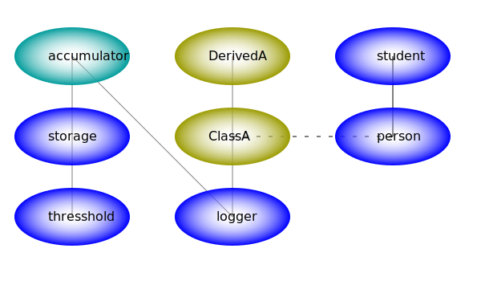

# Реализация контейнера внедрения зависимостей на JavaScript

+ Лаконичность в настройке
+ Отложенная загрузка модулей
+ Возможность отложенной загрузки зависимостей через внедрение самого контейнера
+ Возможность создавать как *singlton* службы, так и отсоединенные *detached*
+ Небольшой размер модуля контейнера (не более 80 строк кода)
+ Асинхронная реализация разрешает конкурентное создание *singlton* зависимостей



## Шаблон определения модулей Dependency Injection

Шаблон **Dependency Injection** основывается на предоставлении модулю всех зависимостей в качестве входных данных фабричной функции. Так ослабляются связи между модулями, позволяя настроить использование любых зависимостей, следовательно, повторно использовать код в различных контекстах.

``` js
//фабричная функция службы accumulator
module.exports = (storage, logger) => {
    //возвращаем экземпляр службы
}
module.exports.sname = "Accumulator service";
module.exports.deps = ["storage", "logger"];
```

Дополнительно, в свойствах фабричной функции указывается массив строк с именами зависимостей (если имеются), а также для отладочных целей - поле *sname*.

Согласитесь, это необременительные требования к определению модулей. Важно соблюсти порядок следования зависимостей в фабричной функции и имен зависимостей в свойстве *deps*.

## Контейнер внедрения зависимостей

Ответсвенность за создание экземпляров и дальнейший жизненный цикл, поиск и внедрение зависимостей, лежит на объекте, называемом **Dependency Injection Container** или DI-контейнер.

Экземпляры служб и весь граф зависимостей создаются в *ленивом* режиме (**Lazy loading**) без необходимости предварительной загрузки модулей.

Реализация DI-контейнера соответствует шаблону **Dependency Injection**, чтобы другие службы могли его внедрить. Такая возможность позволяет отложить загрузку отдельных зависимостей, используя внедренный контейнер в качестве локатора служб.

Ну, а сам DI-контейнер зависит от службы *logger*, чтобы отслеживать порядок загрузки, создания экземпляров или возникающие при этом ошибки.

Пример использования синхронного DI-контейнера:

``` js
const logger = { info: console.log, error: console.error }
//const logger = require('./logger')();
const di = require('./di-cont-sync')(logger);
di.add(require('./modules.json'));

try {
    //detached, not singleton
    di.detach('accum', true);
    //but depends of singleton storage
    const a1 = di.get('accum');
    a1.add(1);
    a1.add(4);
    logger.info('Amount is %d', a1.tot);
    //Amount is 5
    const a2 = di.get('accum');
    a2.add(10);
    a2.add(40);
    logger.info('Amount is %d', a2.tot);
    //Amount is 50
    const a3 = di.get('accum');
    a3.add(100);
    a3.add(400);
    logger.info('Amount is %d', a3.tot);
    //Amount is 500
    const s = di.get('storage');
    logger.info('Total amount is %d', s.tot)
    //Total amount is 555
}
catch (err) {
    logger.error(`Catch: ${err}`);
}
```

Метод *add* DI-контейнера загружает описание служб из объекта, в свойствах которого указаны пути для загрузки модулей, а имена свойств - это имена регистрируемых служб. Такие объекты удобно хранить во внешних json-файлах, наподобие этого:

```json
{
    "config": "./config",
    "logger": "./logger",
    "storage": "./model/storage",
    "tresshold": "./model/tresshold",
    "accum": "./model/accumulator",
    "ClassA": "./model/class-a",
    "DerivedA": "./model/derived-a"
}
```

Регистрация служб носит отложенный характер, никакие модули не загружаются. Всё волшебство происходит в момент обращения за экземпляром службы с помощью метода *get*.

По умолчанию, возвращается *singlton* объект - служба, указатель на которую сохраняется в контейнере и возвращается при последующих запросах.

Метод *detach* DI-контейнера помечает службу как отсоединенную *detached*. Запрос отсоединенной службы методом *get* возвращает новый экземпляр, не связанный с временем жизни контейнера.

## Реализация синхронного DI-контейнера

``` js
module.exports = (logger) => {

    const map = new Map();

    const di = {
        get: async (key, whom='di') => {
            const mod = map.get(key);
            //{ path, expo, inst })
            if (!mod) throw new Error(`Can't find ${key} entry for ${whom} !!`);
            if (mod.inst) return mod.inst;
            if (mod.expo && !mod.detach) {
                logger.info(`Promise singleton creation of ${key}`);
                if (!mod.swear)
                    mod.swear = new Promise(resolve => mod.resolve = resolve);
                return mod.swear;
            }
            //obtain module.exports service factory
            if (!mod.expo) {
                logger.info(`Loading factory for ${key} from path: ${mod.path}`);
                load(mod, whom);
                process.nextTick(logger.info, `Next tick after loading ${key}`)
            }
            //instantiate direct or with injected dependencies
            if (!mod.expo.deps) mod.inst = mod.expo();
            else mod.inst = await inject(mod);
            //dispose when used
            const inst = mod.inst;
            if (mod.swear) mod.resolve(inst);
            if (mod.detach) mod.inst = null;
            logger.info(`Instance of ${key} successfully created`);
            return inst;
        },
        detach: (key, value) => {
            const mod = map.get(key);
            if (!mod) throw new Error(`Can't find ${key} entry for detaching !!`);
            mod.detach = value;
        },
        set: (key, mod) => {
            if (!mod.inst && !mod.path)
                logger.error(`Entry for ${key} not set !!`);
            else
                map.set(key, mod);
        },
        add: (modules) => {
            //map each key to appropriate path
            for (const key in modules) 
                map.set(key, { path: modules[key], expo: null, inst: null, detach: false });
        },
        each: (cb) => {
            //cb(mod, key, map)
            map.forEach(cb);
        },
    }

    async function inject(mod) {
        const expo = mod.expo;
        const args = await Promise.all(expo.deps.map(dep => di.get(dep, expo.sname)));
        return expo.apply(null, args);
    }

    function load(mod, whom) {
        try {
            //expose service factory
            mod.expo = require(mod.path);
            return mod.expo;
        }
        catch (err) {
            throw new Error(`Can't load module from path: ${mod.path} for ${whom}!!`);
        };
    }

    map.set('di', { inst: di });

    return di;
};

module.exports.sname = 'di-container sync';
module.exports.deps = ['logger'];
```
